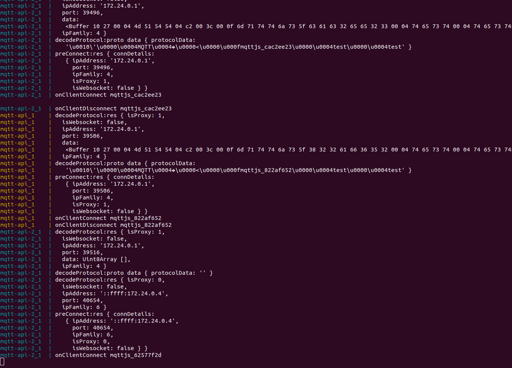

# Aedes proxy example

## Steps

    1 Generate certicates with `generate-cert.sh` 
    ( if FQDN is set to something else than localhost, update docker-compose.yml NGINX_SERVER_HOST accordingly)

    2 `docker-compose build`

    3 `docker-compose up`

    3 Start `node client.js`

## Expected behaviour

Protocol decoder should be triggered only once when using TCP proxy that handles SSL termination.

## Current behaviour

Protocol decoder is randomly triggered twice. 
It might be a bug in the `lib/client.js`, `nextBatch` function ?



## Possible solution

Inside `!client.connackSent && client.broker.trustProxy && buf` condition block

```js
var { data, isProxy } = client.broker.decodeProtocol(client, buf)
if (data) {
  client._parser.parse(data)
} else if (!isProxy) {
  client._parser.parse(buf)
}
``` 